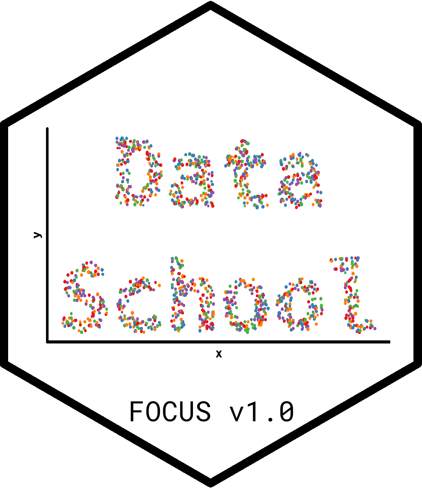
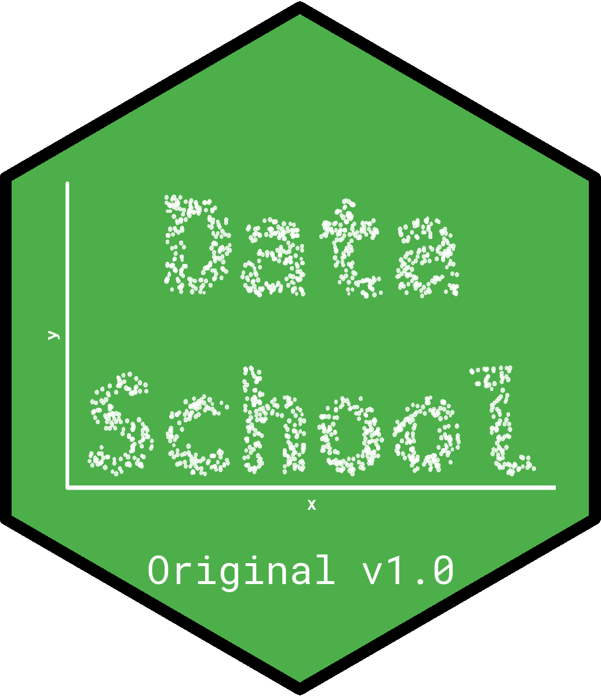

## Data school hex sticker

Basic idea is a scatter plot that spells out data school. I'd like to have something specific for the different cohorts/versions too, but this might be an overcomplication...

### using colorbrewer

### green background

